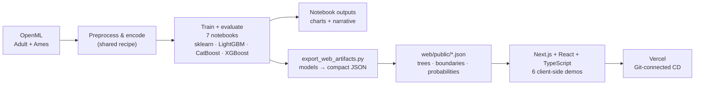

# Dive Deeper into Supervised Learning

> A from-first-principles tour of classical supervised ML — seven teaching notebooks **and** a live, browser-based playground where the models actually run.

[](https://dive-deeper-supervised-learning.vercel.app)
[](LICENSE)
[](requirements.txt)
[](web/package.json)
[](https://dive-deeper-supervised-learning.vercel.app)

---

## 🧭 Recruiter TL;DR

- **What it is:** Seven deeply-explained notebooks covering the full lifecycle of a supervised-learning model — build (trees, boosting, ensembles, k-NN, SVM) → tune (Optuna) → explain (SHAP/LIME/PDP) → decide (thresholding) — plus a **Next.js playground that runs six of the models live in the browser**, no backend.
- **Hardest problem solved:** shipping trained models to a **zero-backend web app** by exporting them to compact JSON and re-implementing inference in TypeScript — the in-browser gradient-boosting model reproduces scikit-learn's `predict_proba` to **0.00e+00** (bit-exact), verified programmatically.
- **Verified results:** every notebook executes end-to-end with **0 errors**; models reach **AUC ≈ 0.93** on income classification and **R² ≈ 0.89** on house-price regression; deployed on Vercel with Git-connected continuous deployment.

**▶ Live demo: https://dive-deeper-supervised-learning.vercel.app**

---

## Overview

Most "intro to ML" material either hand-waves the math or drowns you in it. This project is the middle path: each notebook opens in **plain English with an analogy**, builds up to the code, and gives every single chart a dedicated **"How to Read This Chart"** section — so a beginner understands *why*, and a practitioner gets a clean, correct reference.

It's built for two audiences at once:
- **Learners** who want the intuition behind each model, not just an API call.
- **Hiring managers / engineers** evaluating breadth across the classical-ML stack and the ability to take models from a notebook all the way to a deployed, interactive product.

The whole series uses **two real datasets** end-to-end so you see the same data through every lens, and the companion web app lets anyone *poke* at the models — drag a decision threshold, reshape an SVM boundary, or watch an 80-tree gradient booster re-score a person in real time.

---

## The Notebooks

| # | Notebook | What It Covers | Task |
|---|----------|----------------|------|
| 01 | [Decision Trees](01_decision_trees.ipynb) | Gini/entropy, recursive splitting, feature vs permutation importance, the bias-variance tradeoff, cost-complexity pruning | Classification + Regression |
| 02 | [Boosting Models](02_boosting_models.ipynb) | AdaBoost, LightGBM, CatBoost (native categoricals), XGBoost, class imbalance (SMOTE / `class_weight`), **SHAP**, probability calibration, learning curves | Classification + Regression |
| 03 | [Ensemble Strategies](03_ensemble_strategies.ipynb) | Why diversity works, prediction correlation, bagging, random forests, hard/soft voting, **stacking** with out-of-fold predictions, production pipelines | Classification + Regression |
| 04 | [Hyperparameter Optimization](04_hyperparameter_optimization.ipynb) | Grid vs random vs **Bayesian (Optuna/TPE)** search, search-space design, trial pruning, parameter importance | Both |
| 05 | [k-NN & SVM](05_knn_and_svm.ipynb) | The non-tree classics: distance & feature scaling, choosing *k*, the **kernel trick**, the C and gamma knobs, decision-boundary visualizations, SVR | Both |
| 06 | [Interpretability](06_interpretability.ipynb) | Explainable AI: permutation importance, **PDP & ICE**, **SHAP** (global + local), **LIME**, and surrogate models | Classification |
| 07 | [Evaluation & Threshold Selection](07_evaluation_and_threshold_selection.ipynb) | Why accuracy lies, the confusion matrix, **ROC vs precision-recall**, sweeping the decision threshold, **cost-sensitive** thresholds | Classification |

Ordered as a learning arc: **build models (01–03) → tune them (04) → round out the algorithm zoo (05) → explain them (06) → turn them into good decisions (07).**

---

## 🌐 Live Web Playground

**https://dive-deeper-supervised-learning.vercel.app**

The [`web/`](web/) directory is a **Next.js** app that runs six of the notebooks' models **entirely client-side** — every prediction is computed on your machine from precomputed model artifacts (no server, no upload). Deployed on **Vercel** with Git-connected auto-deploy.

| Demo | What you can do |
|------|-----------------|
| **Decision Tree** | Configure a person, pick a depth, and watch the tree walk its yes/no questions to a prediction — with the categorical splits shown in plain English ("Is marital status = Married-civ-spouse?") |
| **Boosting (LightGBM)** | A real 80-tree LightGBM re-scores as you change any feature — a live "what-if" explanation |
| **Ensembles** | Toggle base models in/out of a soft-voting ensemble and watch accuracy and diversity respond |
| **k-NN & SVM** | Switch *k*, kernel, C, and gamma and watch the 2D decision boundary reshape |
| **Interpretability** | Partial-dependence curves (global) + per-person SHAP explanations (local) |
| **Threshold Selector** | Pick a model, drag the threshold, and watch the confusion matrix and ROC/PR operating points update live |

Every demo has a plain-language **"how to read this"** note explaining what you're seeing.

---

## Architecture

The core design decision: **the deployed models run with no backend at all.** Rather than stand up an inference server (or ship a heavy ONNX/WASM runtime), each trained model is exported to **compact JSON** and its inference re-implemented in TypeScript. Tree/boosting traversal, k-NN voting, and threshold metrics are all simple enough to run in a few milliseconds in the browser — which makes the app free to host, instant to load (~106 kB JS), and impossible to break with a server outage.



**Why one-hot for the web tree but ordinal elsewhere?** The tree demo *displays* its splits, so it's trained on one-hot-encoded categoricals to make each split human-readable ("Is relationship = Husband?"). The boosting and SHAP demos only show probabilities/contributions, so they keep the simpler ordinal encoding (and SHAP stays 8 clean features instead of 33). Tradeoffs like this are called out in the notebooks and code.

---

## Tech Stack

**Modeling & analysis (Python 3.12)**
- **scikit-learn** — trees, ensembles, k-NN, SVM, metrics, pipelines, inspection (PDP/ICE, permutation importance)
- **LightGBM · CatBoost · XGBoost** — gradient boosting (CatBoost chosen where native categorical handling matters)
- **Optuna** — Bayesian hyperparameter optimization
- **SHAP · LIME** — model interpretability
- **imbalanced-learn** — SMOTE / class-weight handling
- **matplotlib · seaborn** — visualization

**Web playground**
- **Next.js 15 · React 19 · TypeScript 5.7** — no runtime dependencies beyond the framework; all inference is hand-written TS
- **Vercel** — hosting + Git-connected continuous deployment

Full pinned versions in [`requirements.txt`](requirements.txt) and [`web/package.json`](web/package.json).

---

## Skills Demonstrated

- **Classical / supervised machine learning** — decision trees, gradient boosting, ensembles (bagging/voting/stacking), k-NN, SVM, across both classification and regression
- **Model interpretability / Explainable AI** — SHAP, LIME, partial dependence, ICE, permutation importance, surrogate models
- **Hyperparameter optimization** — grid, random, and Bayesian (Optuna/TPE) search with pruning
- **Model evaluation & decisioning** — ROC/PR analysis, probability calibration, cost-sensitive threshold selection
- **Handling class imbalance** — SMOTE and class-weighting on genuinely imbalanced data
- **Data preprocessing & feature encoding** — a shared, leakage-free encode/impute pipeline from raw OpenML to model-ready
- **Client-side model deployment (edge/browser inference)** — exporting trained models to JSON and re-implementing inference in TypeScript
- **Front-end engineering** — Next.js / React / TypeScript, responsive design, accessible interactive components
- **Cloud deployment & CD** — Vercel with Git-connected continuous deployment
- **System design & tradeoff reasoning** — documented decisions (zero-backend architecture, encoding choices per demo)
- **Technical communication** — heavily-explained notebooks and an interface designed to make ML legible to non-experts

---

## Getting Started

### Run the notebooks

```bash
# Python 3.12 recommended
pip install -r requirements.txt
jupyter notebook
# open any of 01–07 and "Run All" — datasets download automatically from OpenML on first run
```

No GPU required; every notebook runs on CPU in a few minutes.

### Run the web app

```bash
cd web
npm install
npm run dev     # http://localhost:3000
```

The app reads its model artifacts from `web/public/*.json`. Those are committed and ready to use as-is. To **regenerate** them from freshly trained models:

```bash
# from the repo root, with the Python deps installed
python scripts/export_web_artifacts.py
```

This trains each demo's model and writes the compact JSON (including a check that the in-browser boosting model matches scikit-learn exactly).

---

## Project Structure

```
.
├── 01_decision_trees.ipynb              # \
├── 02_boosting_models.ipynb             #  |
├── 03_ensemble_strategies.ipynb         #  |  the 7 teaching notebooks —
├── 04_hyperparameter_optimization.ipynb #  |  each self-contained, executed with outputs
├── 05_knn_and_svm.ipynb                 #  |
├── 06_interpretability.ipynb            #  |
├── 07_evaluation_and_threshold_selection.ipynb # /
├── requirements.txt                     # pinned Python dependencies
├── LICENSE                              # MIT
├── scripts/
│   └── export_web_artifacts.py          # trains demo models → compact JSON in web/public
└── web/                                 # the Next.js playground
    ├── app/
    │   ├── page.tsx                     # tabbed shell + hero
    │   ├── models.ts                    # single source of truth for the demo tabs
    │   ├── components/                  # one component per demo (Tree, Boost, Ensemble, KnnSvm, Interp, Threshold, About)
    │   └── lib/                         # shared form + tooltip + model-input helpers
    └── public/                          # precomputed model artifacts (JSON) the demos load
```

---

## Testing & Verification

There is **no formal automated test suite** — this is a teaching/portfolio repo, not a service. Correctness is instead verified two concrete ways:

- **Every notebook is executed end-to-end** (via `jupyter nbconvert --execute`) and committed **with its outputs and 0 error cells** — so what you see is real, reproducible output on real data, not hand-written results.
- **The browser models are validated against scikit-learn.** The artifact-export step programmatically checks that the in-browser LightGBM traversal reproduces `predict_proba`, and it matches to **0.00e+00** over 1,000 test rows. The frontend↔model feature encoding was likewise verified to match the trained model exactly.

---

## Deployment

- **Live:** https://dive-deeper-supervised-learning.vercel.app
- **Platform:** Vercel, **Root Directory = `web`**, framework auto-detected (Next.js)
- **CD:** the GitHub repo is connected to the Vercel project, so **every push to `main` auto-builds `web/` and deploys to production**, with preview URLs on branches/PRs.
- **No backend / no secrets:** the app is fully static + client-side, so there are no server env vars or databases to configure.

---

## Impact / Results

All numbers below are **measured during notebook execution** on held-out test sets (Adult Income for classification, Ames Housing for regression) and are reproducible by re-running the notebooks:

| Area | Result |
|------|--------|
| Boosting (LightGBM / CatBoost / XGBoost) | Test **AUC ≈ 0.93** on >$50K income classification |
| Ensembles / Random Forest (regression) | Test **R² ≈ 0.89** on house-price prediction |
| Hyperparameter optimization | Optuna beat the default-params baseline (AUC 0.9136 → **0.9147**) using fewer trials than grid search |
| Interpretability | Depth-3 surrogate tree reproduced the black-box model's decisions with **89% fidelity** |
| Threshold selection | Choosing a cost-optimal threshold cut total error cost by **~40%** vs the default 0.5 |
| Web inference fidelity | In-browser boosting matches scikit-learn `predict_proba` to **0.00e+00** |
| Reproducibility | **7/7 notebooks execute with 0 errors** |

---

## Roadmap / Known Limitations

- **No automated CI** yet — a lightweight GitHub Action that executes the notebooks (smoke test) and type-checks the web app would guard against regressions.
- **Adult is a dated dataset** (1994 census); its learned correlations (e.g. marital status ↔ income) reflect that era and are used purely to teach method, not to make claims about people today. The notebooks and UI call this out.
- **Web demos use sampled/precomputed models** (e.g. an 80-tree booster, 2D toy data for k-NN/SVM) chosen so everything runs instantly in-browser; the notebooks train the full-scale versions.
- Possible additions: an optional FastAPI serving layer to demonstrate server-side deployment, and an "Open in Colab" badge per notebook.

---

## License

Released under the [MIT License](LICENSE).

---

*By Shivani Bokka — part of a broader "Dive Deeper" series spanning linear models, deep learning, and unsupervised learning.*
